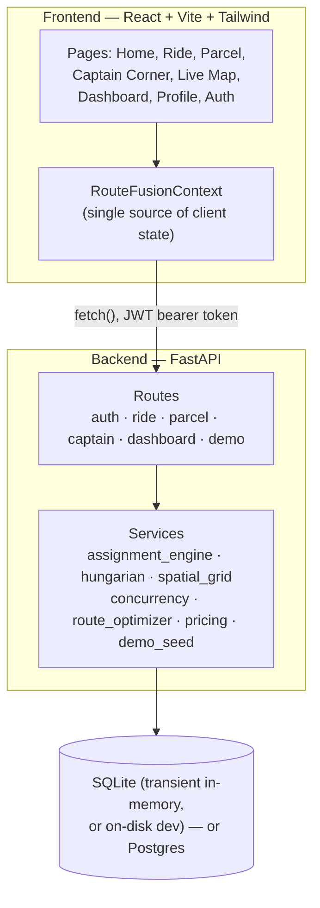
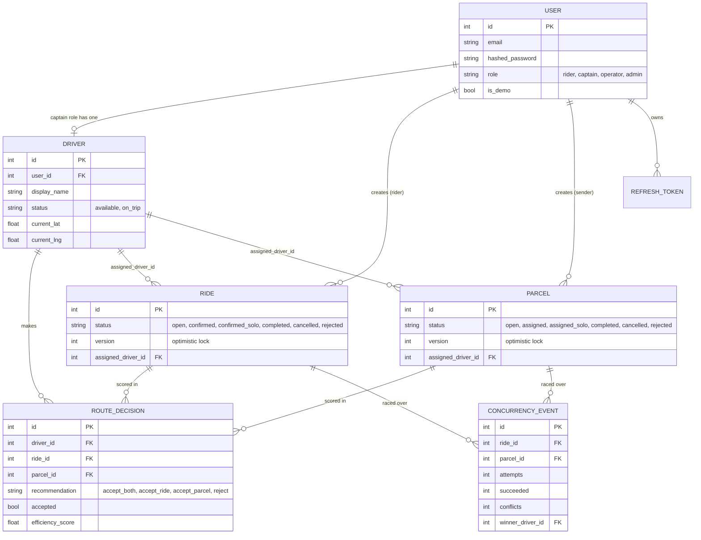
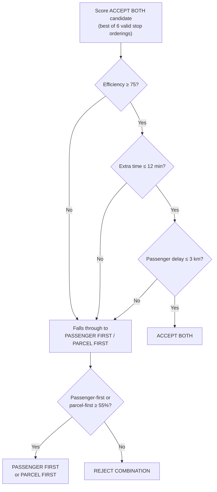
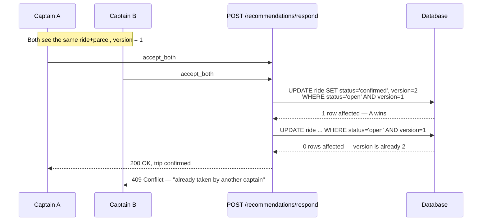

# RouteFusion

RouteFusion combines a passenger ride and a parcel delivery into a single optimized trip. A captain sees one AI-backed recommendation — accept both, accept just the ride, accept just the parcel, or reject — and the app explains exactly why, using a real two-stage Hungarian (optimal assignment) algorithm instead of a heuristic score.

By default the app runs in **transient in-memory mode**: zero external database, fresh state on every boot. PostgreSQL is fully supported when you want persistence instead.

## Table of contents

- [Architecture](#architecture)
- [Data model](#data-model)
- [Core workflows](#core-workflows)
- [System design](#system-design)
- [API reference](#api-reference)
- [Folder structure](#folder-structure)
- [Local development](#local-development)
- [Deployment](#deployment)
- [Security notes](#security-notes)

## Architecture

A monorepo split into a React frontend and a FastAPI backend, talking over a JSON REST API with JWT auth.



- **`frontend/`** — Vite + React + TypeScript + Tailwind SPA. One shared `RouteFusionContext` holds all client state (auth session, dashboard data, current recommendation, ride/parcel queues) and is the only thing pages talk to — no page fetches the API directly.
- **`backend/`** — FastAPI app, SQLAlchemy 2.0 models, JWT auth (access + refresh + a revocation blacklist), and the assignment/optimization engine described below.
- **`docs/`** — planning artifacts from before implementation: [UI wireframes](docs/ui-wireframes.md), [component tree & layout architecture](docs/architecture.md), and [deployment notes](docs/deployment-guide.md).

### Design principles

- **Demo-first, not enterprise-first.** Transient in-memory mode by default; PostgreSQL is opt-in for persistence.
- **Matching is a real optimal-assignment algorithm**, not a per-driver heuristic score — see [System design](#system-design).
- **Explainability at the point of decision.** A captain doesn't just see a score; the UI shows exactly which constraints passed or failed and why, sourced from the same numbers the backend used to decide.
- **Correctness under concurrency.** Two captains can be shown overlapping recommendations; only one can ever win the accept.

## Data model



The canonical SQL DDL lives in [backend/schema.sql](backend/schema.sql); the versioned migration history lives in [backend/alembic/versions/](backend/alembic/versions/).

- **`version`** on `rides`/`parcels` backs optimistic locking (see [Concurrency](#concurrency)).
- **`assigned_driver_id`** on `rides`/`parcels` is what makes multi-captain support possible: it's how the app knows *whose* active trip a given confirmed row belongs to, instead of assuming there's only ever one driver in the system.
- **`concurrency_events`** is the audit trail behind the dashboard's "Concurrency Guard" panel — one row per stress test run.

## Core workflows

### 1. Captain recommendation — the two-stage assignment pipeline

Every time a captain asks "what should I do next?", the backend doesn't just look at *their* nearby requests — it re-solves the assignment for every available driver and every open request, then hands each captain their own slice of the answer.

```mermaid
sequenceDiagram
    participant FE as Frontend
    participant API as GET /captain/recommendations
    participant Engine as assignment_engine.run_assignment
    participant Opt as route_optimizer.optimize_route
    participant DB as Database

    FE->>API: GET (JWT bearer token)
    API->>DB: resolve current driver for this user
    alt driver already has a confirmed trip
        API->>DB: fetch that ride/parcel directly
    else no active assignment
        API->>Engine: run_assignment(db)
        Engine->>DB: load available drivers, open rides, open parcels
        Engine->>Engine: Stage 1 — Hungarian(drivers × rides)
        Engine->>Engine: Stage 2 — Hungarian(driver+ride bundles × parcels)
        Engine-->>API: AssignmentResult (per-driver ride + optional parcel)
    end
    API->>Opt: optimize_route(driver, ride, parcel)
    Opt-->>API: efficiency_score, extra_distance/time,<br/>accept_both_analysis, recommendation label
    API-->>FE: RecommendationResponse
```

### 2. The ACCEPT BOTH decision

`route_optimizer.optimize_route()` always evaluates the combined bundle, even when it isn't ultimately chosen — that's what powers the "Why (not) Accept Both?" panel in Captain Corner.



The three thresholds (`75`, `12`, `3`) are defined once in `route_optimizer.py` and returned to the frontend as a `constraints` list with each one's actual value and pass/fail state — the UI never hardcodes or recomputes them.

### 3. Concurrency — two captains, one request



The `/demo/stress/concurrency` endpoint on the Dashboard proves this on demand: it fires several simultaneous accept attempts at the same pair through this exact code path and reports "1 succeeded, N conflicted."

### 4. Demo bootstrap

`GET /demo/load` seeds the classic single-driver scenario (one ride, one parcel, "Captain Arjun"). `POST /demo/seed-fleet` goes further — it creates several **real** captain accounts (not fake rows; full signup + JWT-loginable `User`+`Driver` records) plus scattered rides/parcels, so the two-stage assignment engine has an actual multi-driver pool to solve over. Log into any seeded captain via the normal login form to see their own, genuinely different recommendation.

## System design

RouteFusion's captain matching is a real assignment-problem pipeline, not a per-driver heuristic score. The full implementation lives in `backend/app/services/`.

### The problem

Matching drivers to rides and parcels is a **3-dimensional assignment problem** (driver × ride × parcel), which is NP-hard in general. Rather than brute-forcing it, RouteFusion decomposes it into two sequential **2-dimensional assignment problems**, each solved optimally:

- **Stage 1 — drivers × open rides.** Cost = haversine distance from a driver's current location to each ride's pickup. Solved with a from-scratch Kuhn-Munkres (Hungarian) implementation (`hungarian.py`), O(n³) on the candidate matrix.
- **Stage 2 — (driver, assigned ride) × open parcels.** Cost = the cheapest extra distance of bundling that parcel onto the driver's already-assigned ride, minimized over all 6 valid stop orderings that respect each job's own pickup-before-drop constraint (`route_optimizer.enumerate_valid_orderings` / `best_combined_extra_distance`). Solved with the same Hungarian function.

This decomposition is optimal *within* each stage but not guaranteed globally optimal across both stages — an explicit, documented trade-off in exchange for tractability. It also means Hungarian's augmenting-path search can match **more drivers** than a naive greedy pass would (greedy never revisits an earlier choice that turns out to block a later match), which is why the dashboard's "optimal vs greedy" comparison only claims a distance improvement when both matched the same number of pairs — otherwise it reports the actual win: more drivers matched.

### Pruning

Before either stage builds its cost matrix, a uniform spatial grid (`spatial_grid.py`) — the same bucketing principle behind geohash/H3 — identifies each driver's local neighborhood, purely to report realistic "candidates evaluated → pruned to N" numbers on the dashboard. It does **not** gate which pairs the solve actually considers: at this app's demo-scale cap (`CANDIDATE_CAP = 200`), an exhaustive cost matrix is trivially cheap, and actually excluding "distant" candidates risks silently missing the true optimum. Pruning here is reporting, never a correctness risk.

### Concurrency

Two captains can be shown overlapping recommendations and both try to accept at once. `services/concurrency.py` claims a ride/parcel with a conditional `UPDATE ... WHERE status='open' AND version=<snapshot>` — optimistic locking that only needs an atomic conditional update, not `SELECT ... FOR UPDATE`, so it works identically on the app's default transient SQLite store and on Postgres. Zero rows affected means someone else claimed it first; the caller gets a `409` instead of silently double-booking the request. The *reject* path uses the same guarded conditional update, so a captain rejecting a now-stale recommendation can never clobber another captain's just-confirmed accept.

One caveat specific to the default transient mode: it backs every request with a single shared in-memory SQLite connection (`StaticPool`), and the `sqlite3` driver isn't safe for genuinely concurrent access from multiple threads at once — and FastAPI dispatches sync route handlers via a thread pool, so ordinary concurrent HTTP traffic already runs on separate threads. `database.get_db()` serializes each request's session lifetime behind a lock for that reason when running on SQLite; Postgres deployments skip it entirely since real concurrent connections don't need it.

## API reference

### Authentication (`/auth`)

| Endpoint | Method | Purpose |
|---|---|---|
| `/auth/signup` | POST | Create a real account (`rider`, `captain`, or `operator`). A `captain` signup auto-creates a `Driver` profile. |
| `/auth/login` | POST | Email/password login, returns access + refresh JWTs. |
| `/auth/refresh` | POST | Exchange a refresh token for a new access token. |
| `/auth/logout` | POST | Revokes the current session (blacklists the token). |
| `/auth/me` | GET | Current user's profile. |
| `/auth/demo-login` | POST | Demo operator session, auto-seeds the classic scenario. |

### Rides & parcels

| Endpoint | Method | Purpose |
|---|---|---|
| `/ride` | POST / GET | Create a ride request / list recent ones. |
| `/ride/{id}` | DELETE | Cancel a ride (releases a linked driver/parcel if it was combined). |
| `/parcel` | POST / GET | Create a parcel request / list recent ones. |
| `/parcel/{id}` | DELETE | Cancel a parcel (symmetric to ride cancellation). |

### Captain (`/captain`)

| Endpoint | Method | Purpose |
|---|---|---|
| `/captain/recommendations` | GET | The calling captain's own driver, assigned request(s), route metrics, and `accept_both_analysis`. Anonymous requests fall back to the shared demo driver. |
| `/captain/recommendations/respond` | POST | `accept_both` / `accept_ride` / `accept_parcel` / `reject`. Optimistically locked — returns `409` if the request was already claimed. |
| `/captain/recommendations/complete` | POST | Closes out the calling captain's active route. |

### Dashboard

| Endpoint | Method | Purpose |
|---|---|---|
| `/dashboard` | GET | Metrics, recent activity, live assignment-engine stats, and concurrency-guard stats. |
| `/snapshot` | GET | Dashboard + current recommendation + rides + parcels in one call — what the frontend actually fetches on load and after every action (there's no polling; the UI refetches this once per user action). |

### Demo

| Endpoint | Method | Purpose |
|---|---|---|
| `/demo/load` | GET | Seed the single classic ride+parcel+captain scenario. |
| `/demo/clear` | POST | Wipe all rides/parcels/decisions. |
| `/demo/seed-fleet` | POST | Create several real, loginable captain accounts plus scattered rides/parcels. |
| `/demo/stress/concurrency` | POST | Fire N simultaneous accept attempts at one ride+parcel pair to demonstrate the concurrency guard. |

## Folder structure

```text
routeFusion/
├── README.md
├── docs/                        # pre-implementation planning artifacts
├── backend/
│   ├── app/
│   │   ├── routes/              # auth, ride, parcel, captain, dashboard, demo
│   │   ├── services/
│   │   │   ├── hungarian.py         # from-scratch Kuhn-Munkres solver
│   │   │   ├── assignment_engine.py # two-stage driver/ride/parcel pipeline
│   │   │   ├── spatial_grid.py      # geohash-style pruning (reporting only)
│   │   │   ├── concurrency.py       # optimistic-locking accept/reject
│   │   │   ├── route_optimizer.py   # per-pair scoring + accept_both_analysis
│   │   │   ├── pricing.py
│   │   │   ├── demo_seed.py
│   │   │   └── locations.py
│   │   ├── auth.py / config.py / database.py / dependencies.py
│   │   ├── main.py
│   │   ├── models.py
│   │   └── schemas.py
│   ├── alembic/versions/        # 0001 initial schema, 0002 optimistic locking
│   ├── tests/
│   ├── requirements.txt
│   └── schema.sql
└── frontend/
    └── src/
        ├── components/          # PanelCard, PanelHeader, AuthPanel, ...
        ├── context/
        │   └── RouteFusionContext.tsx   # single source of client state
        ├── lib/                 # api.ts, format.ts, googleMaps.ts, ...
        ├── pages/                # Home, RideRequest, ParcelRequest, LiveMap,
        │                         # Dashboard, Profile, Auth, BookingHubPage
        │                         # (Ride/Parcel/Captain modes in one panel)
        └── App.tsx / main.tsx / types.ts / index.html / package.json / vite.config.ts
```

## Local development

### Backend

```bash
cd backend
python3 -m venv .venv
.venv/bin/pip install -r requirements.txt
.venv/bin/uvicorn app.main:app --reload --port 8000
```

For test/dev extras:

```bash
.venv/bin/pip install -r dev-requirements.txt
.venv/bin/pytest -q
```

### Frontend

```bash
cd frontend
npm install
npm run dev
```

Open `http://localhost:5173`. Optional environment variables:

- `VITE_API_BASE_URL` — defaults to `http://127.0.0.1:8000`.
- `VITE_GOOGLE_MAPS_API_KEY` — enables the live Google Maps renderer instead of the built-in straight-line fallback map. The key needs `Maps JavaScript API`, `Places API`, and `Directions API` enabled for road-snapped routes.

### Trying the multi-captain / concurrency features

1. Open the **Dashboard** and click **"Seed demo fleet"** — creates several real captain accounts plus rides/parcels.
2. Sign in as any seeded captain (**Profile → Sign in as a captain**, password `routefusion-captain`) and open **Captain Corner** — each captain gets their own, genuinely different recommendation, including the "Why (not) Accept Both?" breakdown.
3. Back on the Dashboard, click **"Run concurrency stress test"** to watch several simultaneous accept attempts resolve to exactly one winner.

## Deployment

- **Transient mode (default) needs one persistent process**, not multiple replicas or serverless functions-per-request — each instance would get its own isolated in-memory database, so state would be inconsistent across requests. A single Render/Railway/Fly web service (or one Docker container) is fine; state simply resets on restart, which matches the demo's intent.
- **To persist data across restarts**, set `ROUTEFUSION_TRANSIENT_MODE=false` and `DATABASE_URL` (Postgres) on the host, then apply migrations once:
  ```bash
  cd backend && .venv/bin/alembic upgrade head
  ```
  The migrations use Alembic's batch mode, so they run correctly on SQLite *and* Postgres — safe even if your deploy pipeline runs them unconditionally regardless of which mode is active.
- If your platform's start command always runs `alembic upgrade head` before boot, that's harmless but redundant while in transient mode (the app creates its own schema fresh via `create_all()` on every boot regardless of what Alembic did) — only meaningful once you switch to persistent Postgres.

## Security notes

- Keep `.env` out of version control (already covered by `.gitignore`).
- Rotate any database password or API keys before making the repo public or handing it off.
- If you enable PostgreSQL, prefer Supabase's pooler connection and URL-encode special characters in the password.
- Demo captain accounts created via `/demo/seed-fleet` share one fixed password (`routefusion-captain`) — that endpoint is meant for local/demo use, not a public production deployment without additional access control.
